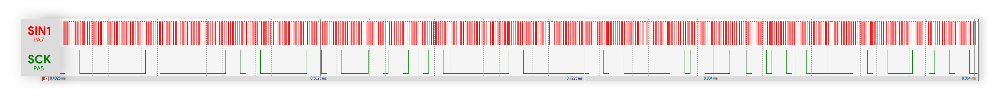

# But du projet
Le but sera de faire fonctionner diverses LEDS à l'aide d'un STM32 et tout cela en langage Assembler.
# Fonctionnalitées

## Variables
|Nom|Description|Source|Type|
|---|---|---|---|
|Barette1|Jeu de LED : 16\*3 Données sur 1 octet|[LUMIERES.inc](LUMIERES.inc)|```Data Memory```|
|Barette2|2ème jeu de LED avec des couleurs différentes|[LUMIERES.inc](LUMIERES.inc)|```Data Memory```|
|SCLK|PIN pour SCLK (5)|[FonctionEtape2.asm](FonctionEtape2.asm)|```Egalitée```|
|SIN1|PIN pour SIN1 (7)|[FonctionEtape2.asm](FonctionEtape2.asm)|```Egalitée```|
|MILSEC|Pour Tempo(Nms) -> Le nombre d'itération pour avoir 1ms|[FonctionEtape2.asm](FonctionEtape2.asm)|```Egalitée```|
|PF|Décalage à 31 bits pour le Poid Fort|[FonctionEtape2.asm](FonctionEtape2.asm)|```Data Memory```|
|DataSend|Variable globale pour savoir si une donnée est transmise|[FonctionEtape2.asm](FonctionEtape2.asm)|```Data Memory```|
## Fonctions
|Nom|Argument(s)|Retour|Description|
|---|---|---|---|
|Set_X|**1** - R0 : PINAX||Pour un output donné, met à 1 ce dernier.|
|Reset_X|**1** - R0 : PINAX||Pour un output donné, force à 0 ce dernier.|
|DriverGlobal|||Envoie les signaux liés à la LED|
|Tempo|**1** - R0 : Nms||Pour un temps donné, le processeur se met en attente (similaire à sleep)|
|DriverReg|**1** - R0 : \*LEDArray||Pour une Barette de LED donnée, envoie les signaux demandés|

---
Chaque fonction prendra des arguments de R0 à R3 (avec R3 étant une référence au tas si le besoin d'argument est supérieur à 3). Le renvoi se fait sur R0.

## Main

La première chose pour l'étape 2 est de mettre l'argument de Init_Cible à 1. Malheuresement cette partie étant précompilé, il n'est pas possible de modifier directement les variables qu'il lit dans la pile. En effet en lisant les premières lignes nous pouvons appercevoir quelques lectures de variables :
```assembly
Init_Cible PROC
	PUSH {R4-R6}
	MOV R4,R0
	LDR R0,[pc,#212]  ; @0x080009A4
	LDR R0,[R0,#0x18] ; On lit dans 0x40021000 la variable en 0x18
	ORR R0,R0,#0x0C   ; On force la valeur 0x0C dans R0
ENDP
```

Visiblement, d'après la librairie STM32 0x40021000 correspond au RCC, plus précisement au APB2ENR *(décalé de 24 octets.)* :

```c
	RCC_TypeDef * rccPointer = RCC ;                  //0x40021000
	volatile uint32_t * apb2enrValue = &(RCC->APB2ENR);		//0x40021018
```

En réalité j'ai par la suite changé ce paramètre en 1. Avec la valeur forcée en 0x0C, cela va donner 0x0D soit 1101. D'après la datasheet cela devrait activer la clock sur le GPIOA et B. le 0x01 lui va activer le AFIO qui est étrange ? L'argument de la fonction ne serait donc pas cette variable, qui est juste globale. Mais je ne vois pas d'autre solution pour le moment.. En effet bien que R4 et R6 sont égaux à 0 dès le lancement de cette fonction, elles sont directement modifiée pour lire des variables stockées dans le tas. 

(Par la suite le Timer2,3,4 sont allumés (APB1ENR |= 0x07))

On appelle ensuite DriverReg qui va lire dans R0 l'adresse du tableau de LEDS. Ce dernier doit contenir les 16\*3 valeurs de leds. Une tempo est ensuite lancée, et un nouveau jeu de led est lu.

## Variables globales

- SCLK *(5)* et SIN1 *(7)* sont des variables globales permettant avec la fonction Set/Reset_X de définir l'état de sortie d'une pin X. 
- PF *(1<<31)* est le poids fort, comme il n'est pas possible d'utiliser l'instruction **MOV** avec des nombres supérieurs à 1 octet, il est préférable d'utiliser une variable globale avec cette valeur.
- Barette1 (16\*3 valeurs), tableau contenant pour chaque LED *(16)*, le niveau RVB.

## Chronogramme

Voici le premier chronogramme observable avec les états de SCLK et SIN1. Aucun test matériel n'a encore été réalisé :

Dans la dernière version du programme, deux jeux de LEDS sont envoyés après une tempo de quelques millisecondes. Voici les chronogrammes de ces dernières en simulation :


# Réaliser un code assembler à partir de C
Comme vous le savez le code en langage C peut être compilé puis récupéré en assembler. C'est justement ici une solution que j'ai trouvé pour mieux comprendre différents principes, ou si certaines instructions ne me paraissent pas clair.
Bien évidemment le but du projet n'est pas de recopier bêtement du code que le compilateur peut réaliser, mais de comprendre et de voir comment faire différents algorithmes en Assembler.

La première chose est d'installer le package suivant sur une machine Linux :
```bash
sudo dnf install arm-none-eabi-gcc
```
*J'utilise Fedora donc mon package manager est dnf, mais cela fonctionne avec apt ou pacman*

Ensuite il suffit de créer un programme en C, voici en un par exemple qui m'a aidé à comprendre l'inversion des bits, ou comment le C récupère les arguments d'une fonction :
```c
void set(int pin);
int invert(int x);

void * gpioA = (void *)0x40010800;

int main(void)
{
	set(5);
	invert(0x20);
	return 0;
}

void set(int pin){ *((short *)(globalPtr+0xc)) |= (0x01 << pin) }
int invert(int x){ return ~x }
```

Ensuite je lance la commande suivante pour compiler le tout dans un niveau d'optimisation choisi :
```shell
arm-bibe-eabi-gcc -OX -c test.c -o test.o
```

|Argument|Type d'optimisation du compilateur|
|---|---|
|-O0|Zero|
|-O1|Normale|
|-O2|Maximale|

Et enfin pour voir le résultat en assembler dans la le terminal :
```shell
arm-none-eabi-objdump -D test.o
```

Nous obtenons le résultat suivant :

```assembly
00000000 <invert>:
   0:e1e00000 mvn   r0, r0
   4:e12fff1e bx    lr

00000008 <set>:
   8:e3a01001 mov   r1, #1
   c:e59f3010 ldr   r3, [pc, #16]@ 24 <add+0x1c>
  10:e5932000 ldr   r2, [r3]
  14:e1d230b5 ldrh  r3, [r2, #5]
  18:e1c33011 bic   r3, r3, r1, lsl r0
  1c:e1c230b5 strh  r3, [r2, #5]
  20:e12fff1e bx    lr
  24:00000000 andeq r0, r0, r0
```